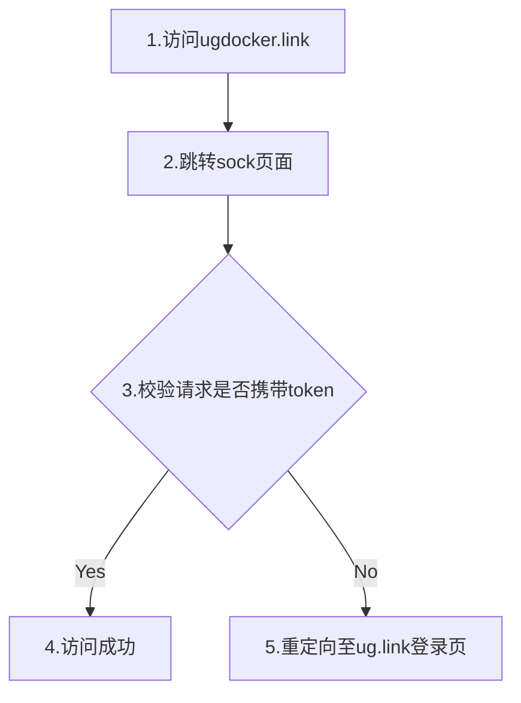
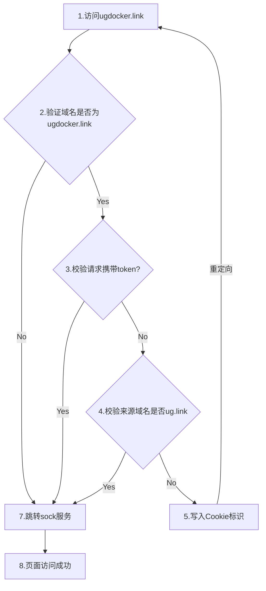

# ug.link-nosigin-access-docker.app

ug.link 无验证访问docker应用的方法,不需要其他东西配合，纯改配置文件

**该方法仅作参考，出现问题不要找我，不建议小白使用！！！**

**该方法仅作参考，出现问题不要找我，不建议小白使用！！！**

**该方法仅作参考，出现问题不要找我，不建议小白使用！！！**


### 1、

ssh 到你的 NAS，这我就不教了

### 2、

2.1：获取你的 cookie

​	浏览器登录ug.link，访问到你的docker网站 ---》键盘按下 F12


2.2：执行下面命令修改默认配置文件

```shell
sudo cp /etc/nginx/ugreen.conf /etc/nginx/ugreen.conf.bak
sudo nano /etc/nginx/ugreen.conf
```

2.3 在下图为止插入代码,**注意看server_name是否如图所示**


根据需求更改,后保存

```conf
	######################################################################
	# ug.link 生成 docker 的访问链接格式：
	# app-xx-xx.xx.ugdocker.link
	# app - docker端口号 - uglink的ID.cn57.ugdocker.link
	# cn57可能是最近的服务器
	#
	# 跳转拦截标识
	set $is_ok 0;
	# 给个默认cookie,以防无限重定向
	set $my_token "go302:no";
	#
	# 设置 cookie 值
	# 换成你自己的 端口!!!
	# 换成你自己的 cooike!!!
	# 你有几个 你就再起几个，下面的8848，43955是端口
	# 最好不要设置含有重复数字的端口，比如 1234，11234，如果这样设置，1234应该在上面
	if ($host ~* "8848") {
		set $my_token "ugreen-proxy-token=cc71adb9-9e24-4b61-923e-3b0d9864bb97";
	}
	if ($host ~* "43955") {
		set $my_token "ugreen-proxy-token=c5107ecb-bfdb-4a4b-a06d-10f83664525a";
	}
	#
	# 判断域名是否含有 ugdocker.link
	if ($host ~* ugdocker\.link) {
		set $is_ok 1;
	}
	# 判断是否带 cookie
	if ($http_cookie != "") {
		set $is_ok 0;
	}
	# 判断是否来自ug.link，来自ug.link 的会自带token
	if ($http_referer ~* ug\.link) {
		set $is_ok 0;
	}
	proxy_set_header Referer $myp_referer;
	# 如果直接访问的是 app-xx-xx.xx.ugdocker.link，且不带 cookie，那么设置cookie并重定向再次访问这个网站
	if ($is_ok = 1) {
		add_header Set-Cookie "$my_token;Path=/; HttpOnly; Secure";
		return 302 "$scheme://$host";
	}
	#
	######################################################################
```

2.4： 重载Nginx配置

```shell
sudo nginx -s reload
```

### 3、尽情访问

尽情访问你的docker应用吧

如果你代理了个apche、nginx这些中间件，那么理论上来说，你可以通过一个端口，加指定路径 代理所有内网服务

### 4、还原设置

SSH 到 NAS 

```shell
sudo cp /etc/nginx/ugreen.conf.bak /etc/nginx/ugreen.conf
sudo nginx -s reload
```

## 大致流程

**原流程**



**修改后**


